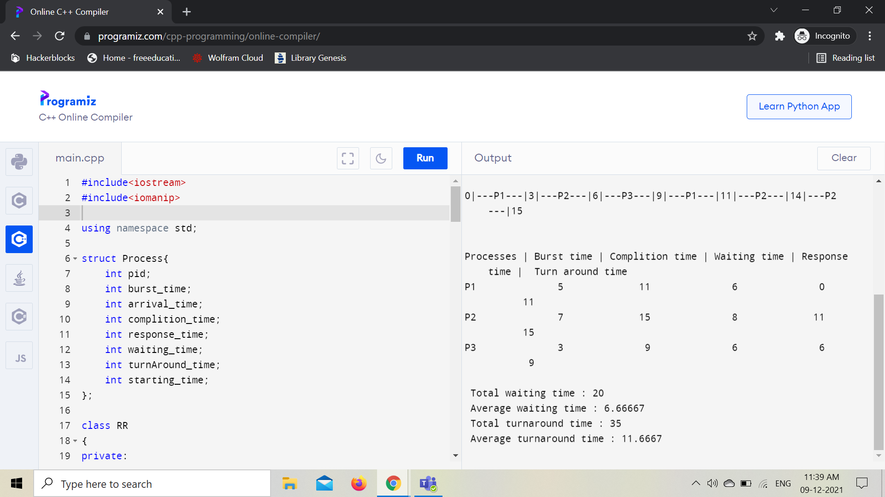

# Operating System Practical
There are some practical example regarding cpu schedueling & processes.

### Q1) Round robin scheduling algorithm
Round-robin is one of the algorithms employed by process and network schedulers in computing.
As the term is generally used, time slices are assigned to each process in equal portions and in circular order, handling all processes without priority.

* Output

### Q2 Demonstration of Fork()

In this program, we are demonstrating the fork() function which is used for creating sub / child processes.

* Output

